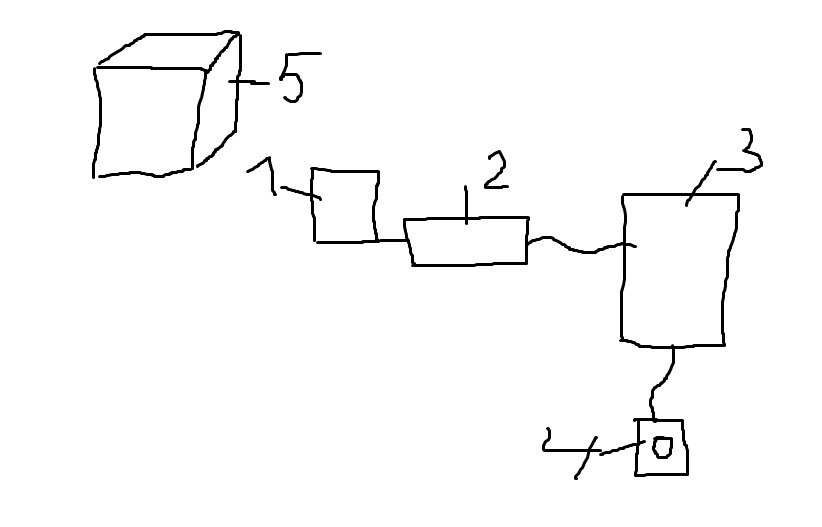
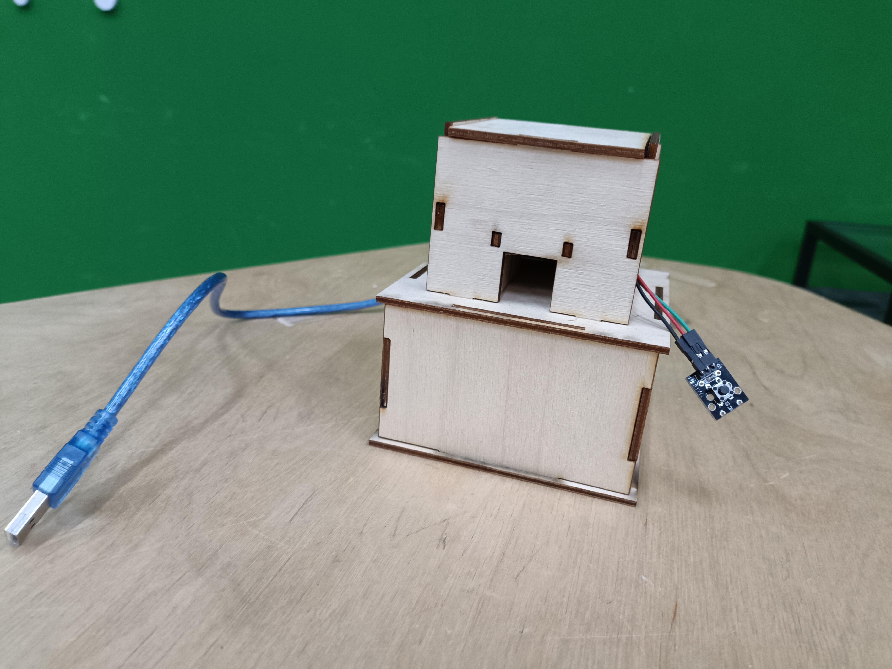
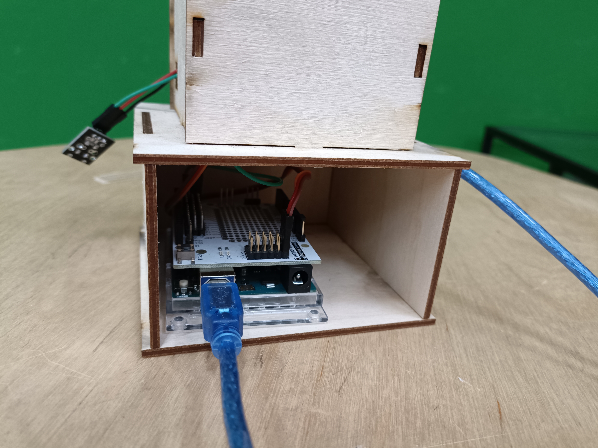
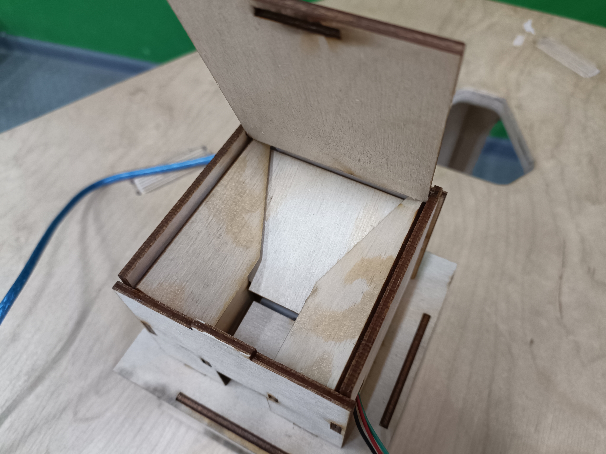

# candy-feeder
Для создания данного изделия использовались: 
* Лазерный гравер
* Лист фанеры
* Кривые руки
* Немного магии
## Концепт

1. пластина
2. сервопривод
3. плата arduini uno
4. кнопка
5. корпус
## Корпус

## Arduino
```
#include <Servo.h>
Servo servo;
int button_pin = 2;
int buttonState = 0;

void setup() { 
    pinMode(button_pin, INPUT);
    servo.attach(A0);
}

void loop() {
  buttonState = digitalRead(button_pin);
   if (buttonState == HIGH) { 
    servo.write(90);
    delay (1000);
  }
  else {
    servo.write(0);
    delay (1000);
  }
}
```
## Готовое изделие
Изделие выглядит следующим образом

Нижняя часть специально сделана для платы arduino, также имеется место для размещения батареек.

Вверхней части распологается отсек для конфет. Под ним же находится сервопривод.

## Работоспособность
https://github.com/OSoba-Mask/candy-feeder/assets/144365335/165cadde-ab3f-4204-a837-f003312f5e62

